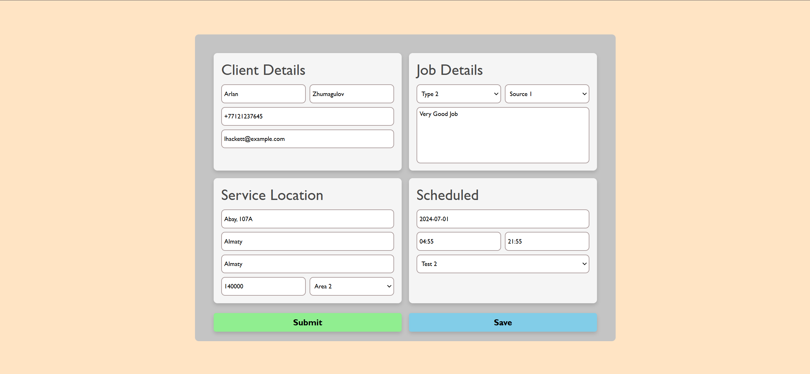
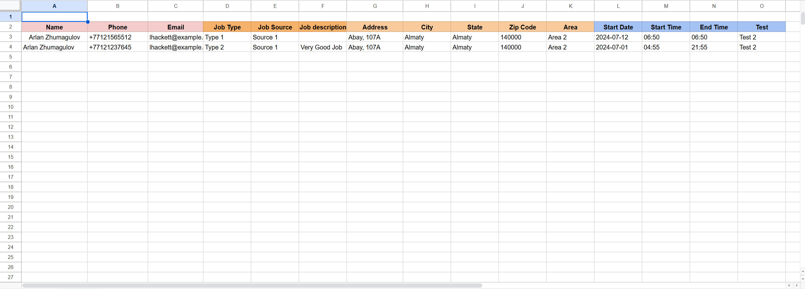

# Main

# Google Sheets

# Features
All information from the form is sent to Google Sheets  
Data can be saved locally in local storage  
Validation Check
# Setup
```
npm init
npm install express ejs googleapis
npm install -g nodemon
npm install body-parser
nodemon index.js      
```
Your form will be [There](http://localhost:2004/)  
[Google Sheets Link](https://docs.google.com/spreadsheets/d/1o_1CqBfl3YsHQjrKE4-_JFJHIx6SVmmLRoUZxTDqWa0/edit?usp=sharing)

>Inspired By [James Grimshaw](https://www.youtube.com/watch?v=PFJNJQCU_lo&t=576s)